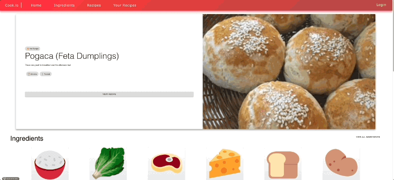

# Cooking-Recipe-Suggestion-Web-App

A web application that provides cooking recipes to users based on the ingredients they possess.
Has over 1930 ingredients and 1489 recipes parsed from publicly available data.

**Created using:**

- React.js
- Express
- Redis (caching)
- MaterialUI
- Firebase (authentication, cloud firestore)
- Python automation
- PostgreSQL
- [Figma](https://www.figma.com/file/o5BUALx2HQwnzOOXdlYtFU/recipe-prototype?node-id=1%3A296)
- Jira





### Initial Setup

1. create a folder on your local computer and `cd` into it
2. git clone `https://github.com/DeluxeViper/Cooking-Recipe-Suggestion-Web-App.git`
3. `cd` into the cloned repo
4. `git remote add upstream https://github.com/DeluxeViper/Cooking-Recipe-Suggestion-Web-App.git`

This repository is divided into two subprojects, frontend and backend.

### Run development server
1. Start backend

    a. Please see backend/README.md for additional information.
   
2. Start frontend. It will ask to run on a different port because the backend is on the same port -> 'Y'

    b. Please see frontend/README.md for additional information.

### Development Practices

###### Working with a feature branch

If the branch does not exist yet (check with the Lead), create the branch locally and then push to GitHub. A feature branch should always be 'publicly' available. That is, development should never exist in just one developer's local branch.

```
$ git checkout -b feature-id main                 // creates a local branch for the new feature
$ git push origin feature-id                        // makes the new feature remotely available
```

Periodically, changes made to main (if any) should be merged back into your feature branch.

```
$ git merge main                                  // merges changes from main into feature branch
```

When development on the feature branch is complete, the developer should open a Pull Request for that branch attempting to merge it into main -- make sure to resolve all merge conflicts.

Once Pull Request is approved, please 'Squash and Merge' the PR into the main branch. The feature branch can then be deleted.
